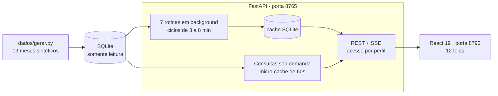

# G2 Analytics

**Plataforma de BI comercial — Python · FastAPI · React · TypeScript**

Doze painéis de gestão sobre a operação de uma distribuidora: faturamento e metas, estoque, contas a receber, funil de vendas, impostos, perfil de cliente e um telão de pedidos ao vivo.

Este repositório é uma **versão pública e executável** de um sistema que roda em produção. O código é o mesmo desenho; os dados são sintéticos, gerados por script. Não é preciso banco, VPN nem credencial: `git clone`, um comando, e o sistema inteiro sobe.

[**▶ Ver a demonstração ao vivo**](https://baister.github.io/G2-Analytics-ERP-Portfolio/) · sem instalar nada


<!-- Capturas: gerar com o demo rodando e salvar em docs/img/. Os dados são
     sintéticos, então não há nada a mascarar. -->

---

## Rodando

**Windows:** dois cliques em `INICIAR_DEMO.bat`. Ele instala o que falta, gera o banco, compila o front e sobe tudo.

**Qualquer sistema:**

```bash
# 1. API (porta 8765)
pip install -r api/requirements.txt
cd api
python -m dados.gerar          # gera 13 meses de operação fictícia
python server.py

# 2. Front (porta 8790), noutro terminal
cd web
npm install
npm run build
PORT=8790 npm start
```

Abra **http://localhost:8790**. As senhas liberam conjuntos diferentes de abas — vale entrar com mais de uma para ver o controle de acesso funcionando:

| Senha | O que enxerga |
|---|---|
| `demo` | tudo |
| `comercial` | Dashboard, Vendas, CRM, Cliente e Clientes |
| `financeiro` | Dashboard, Financeiro, Imposto e Cliente |
| `operacao` | Painel de Pedidos e Estoque |

---

## Como funciona



Dois regimes de consulta convivem:

- **Rotinas em background** — cada painel pesado tem seu próprio ciclo, agrega e publica. A tela abre instantânea porque lê o último ciclo pronto, não porque a consulta é rápida. O rodapé da barra lateral mostra o contador de cada rotina.
- **Consultas sob demanda** — perfil do cliente, painel operacional e a análise cruzada dependem de um parâmetro que só existe no clique. Rodam na hora, com micro-cache de 60 segundos.

---

## O que este repositório demonstra

### Ler um banco de produção sem poder errar

O sistema de origem consulta o banco de um ERP **em produção, sem ambiente de testes paralelo**. Um `DELETE` acidental não teria volta. A resposta foi defesa em três camadas, todas aqui:

1. **Contrato** — a camada de dados não expõe nenhum método de escrita. Não existe `executar()` nem `salvar()`.
2. **Runtime** — [`core/sql_guard.py`](api/core/sql_guard.py): toda consulta passa por um guarda que exige um único comando `SELECT`/`WITH` e recusa `DROP`, `DELETE`, `UPDATE`, `INTO`, `ATTACH` e afins. A ordem de limpeza (comentários → literais → identificadores escapados) é o que evita rejeitar `WHERE situacao = 'pedido cancelado'` ou `SELECT [Update Ts]`.
3. **Driver** — a conexão é aberta em modo somente-leitura; mesmo que algo passasse pelas duas primeiras camadas, o banco recusa.

O guarda entrou em produção de forma gradual (`warn` → `enforce`), e quem autorizou virar a chave foi um teste: [`test_sql_guard.py`](api/tests/test_sql_guard.py) **varre o AST do próprio código-fonte**, extrai toda string SQL — reconstruindo f-strings com os valores interpolados — e submete cada uma ao guarda. É a prova de que ativar o modo estrito não quebraria nenhuma consulta legítima. Uma consulta perigosa escrita hoje quebra a suíte antes de chegar ao banco.

### Resiliência que nasceu de incidente, não de teoria

Em [`bots/base.py`](api/bots/base.py), três padrões e o problema que cada um resolveu:

- **Boot escalonado** — sete rotinas disparando juntas derrubavam as consultas mais pesadas por timeout no rush pós-inicialização. Cada uma entra com atraso crescente; o cache cobre a espera.
- **Manter o último bom** — um ciclo que volta vazio devolve o resultado anterior em vez de publicar um payload mínimo. É a diferença entre "o painel piscou" e "o painel zerou".
- **Degradação por consulta** — o fan-out paralelo isola cada consulta: a que falha vira resultado vazio. O painel perde um gráfico, não a página.

### Um pool de conexões que não encolhe quando o banco cai

[`core/pool.py`](api/core/pool.py) é LIFO (reusa a conexão mais quente), colhe ociosas no próprio `acquire` em vez de manter uma thread de limpeza, e **confia sem health-check em conexão devolvida há menos de 5 segundos** — o round-trip por aquisição aparece no tempo de resposta.

O detalhe que só aparece em produção: quando a abertura falha, a vaga reservada precisa voltar. Sem isso o pool encolhe a cada erro até parar de atender. Há [um teste só para essa condição](api/tests/test_pool.py).

### Erro que não vaza entre threads

Consultas rodam em paralelo. Numa primeira versão, o erro de um worker sobrescrevia o indicador lido por outro — o painel A reportava a falha do painel B. O estado de erro virou **thread-local**, com contrato explícito: vazio em sucesso, mensagem em erro.

### Uma camada de adaptadores que já provou seu valor

As telas nunca chamam a API. Cada aba consome um hook, que busca o payload cru e o converte num contrato tipado através de um **adaptador puro** — função sem estado, testável fora do navegador.

Não é abstração gratuita: foi ela que permitiu este repositório existir. O front original falava com um ERP; aqui fala com um backend completamente diferente, e **nenhuma tela precisou ser reescrita** — só os adaptadores.

### Dados sintéticos que se comportam como dados reais

[`dados/gerar.py`](api/dados/gerar.py) não sorteia números uniformes. Reproduz o *comportamento* de uma distribuidora, porque um painel sobre ruído aleatório não demonstra nada:

- concentração de faturamento em poucos clientes (Pareto);
- sazonalidade semanal — segunda e terça vendem mais, sexta cai;
- devoluções com valor negativo, como num ERP de verdade;
- **inadimplência que decai com a idade do título** — cobrança recupera quase tudo com o tempo. Sem esse decaimento, treze meses de calotes se acumulam e o painel mostra 51% de inadimplência, número que não existe em operação viva;
- parte do catálogo que não vende, para o estoque parado e a classe C da curva ABC significarem alguma coisa;
- camada fiscal em que operação interestadual tem alíquota menor, o que move a alíquota efetiva do painel de impostos.

O resultado foi calibrado até os indicadores fecharem: margem de 31%, ticket de R$ 1.648, inadimplência de 16%, 2 de 15 vendedores acima da meta. A janela é sempre relativa a **hoje** — a demonstração não envelhece.

---

## Testes

```bash
cd api && python -m pytest tests/ -q     # 87 testes
cd web && npm run typecheck && npm run build
```

Nenhum teste toca banco externo — o dataset é gerado na hora. Além do óbvio, a suíte cobre:

- a **varredura de AST** descrita acima;
- o pool sob concorrência (8 threads, 20 aquisições cada, teto de 4 conexões);
- o vazamento de erro entre threads;
- coerência entre painéis: marca e grupo particionam o mesmo faturamento, então as somas têm de bater;
- as regras que quebram a interface se ignoradas — a rosca de títulos com exatamente duas fatias na ordem certa, o funil com três etapas, a série do ritmo parando no último dia com dado.

---

## Estrutura

```
api/
├── core/         sql_guard · pool · db (somente leitura) · cache
├── dados/        gerar.py (dataset sintético) · exportar_demo.py
├── bots/         base.py (BaseBot + BotManager) + 7 rotinas de análise
├── consultas.py  perfil 360º · busca · painel ao vivo · análise cruzada
├── server.py     REST, SSE, acesso por perfil, três estratégias de cache
└── tests/        87 testes
web/
├── src/routes/         uma tela por arquivo
├── src/lib/api/        client · hooks · adapters · types · demo
└── src/components/g2/  KpiCard · Panel · DataTable · filtros · gráficos
```

**Três estratégias de cache, cada uma para um problema diferente** (em [`server.py`](api/server.py)): *single-flight* com TTL curto no painel ao vivo, onde N telas em polling compartilham uma consulta; *LRU por chave* no perfil de cliente; e *LRU por tupla normalizada de filtros* na análise cruzada — ordenar as listas antes de compor a chave faz "marca A,B" e "marca B,A" acertarem o mesmo cache.

---

## Sobre a demonstração ao vivo

O site publicado serve um **retrato** dos dados, gerado no deploy: não há backend por trás de uma página estática. Tudo que é client-side funciona igual — busca, ordenação, paginação, filtro cruzado por clique, expandir gráfico com a planilha ao lado, tema claro/escuro, exportação para Excel e PDF.

O que só existe rodando o projeto completo: o período personalizado e os recortes por dimensão (calculados no servidor), o SSE atualizando as telas quando uma rotina termina, o contador regressivo real e o **403 ao entrar com um perfil que não tem a aba**.

---

## Licença

MIT — ver [LICENSE](LICENSE). O código é meu; os dados são inventados.
